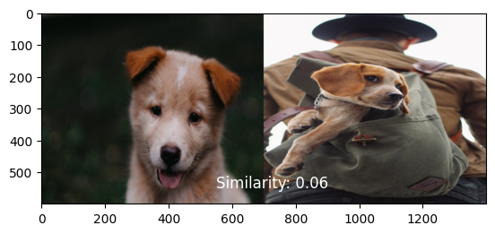
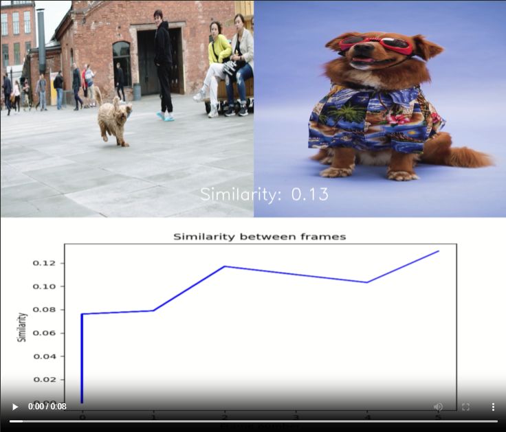
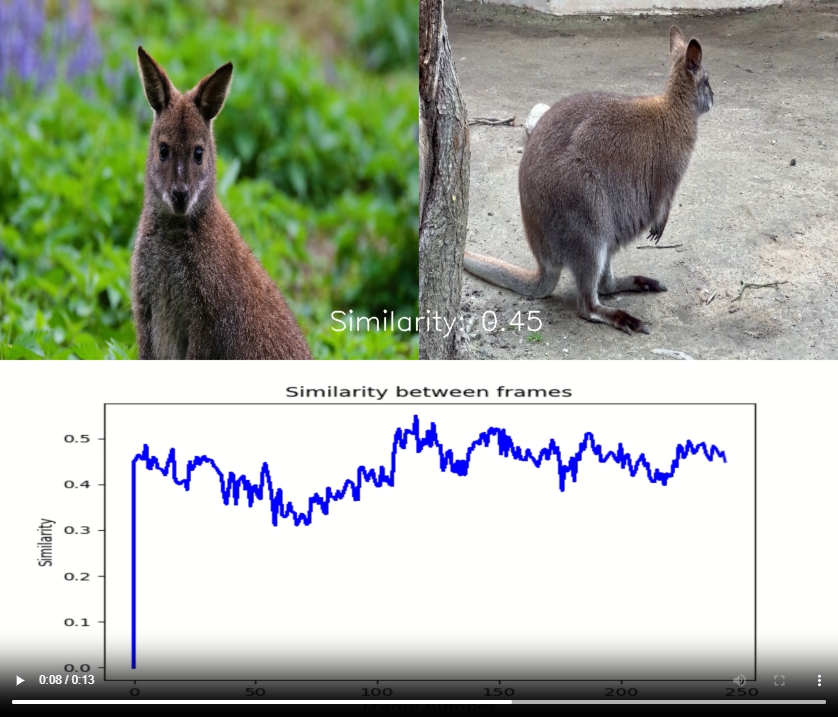
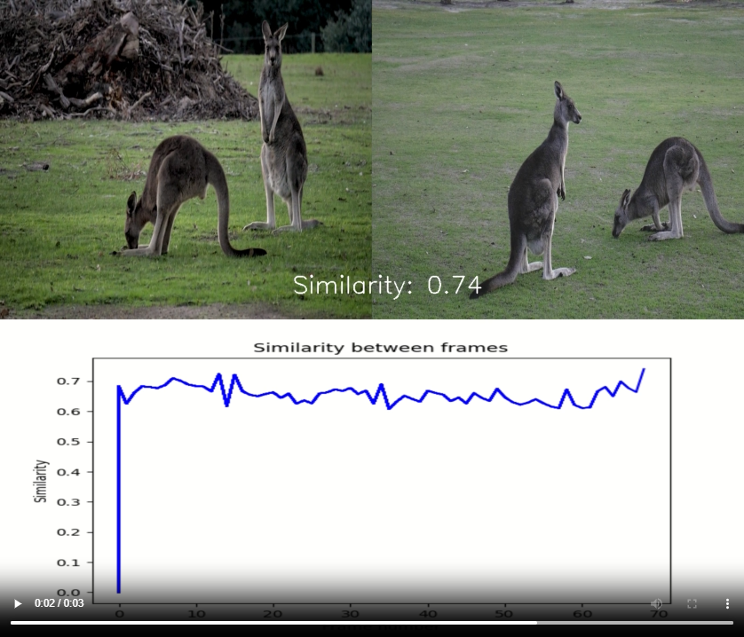

## Image Embedding Class

Class for performing embedding on images using Google's MediaPipe library (Apache 2.0 License).
This class' purpose is to calculate similarity between 2 images or video frames,
using Google's MediaPipe library. It works by embedding the images so they
are represented as a "grouped" array (similar to clustering), and then comparing
these 2 arrays will return a float value (-1 to 1) representing how similar these images are.

### Prerequisites:

* Download this repo and create a new virtual environment (venv) using `python -m venv .venv`
* Activate the venv and install the requirements using `pip install -r requirements.txt`

## Usage:

* To use this Python module, create a new .py-file and import it using `from image_embedding import ImageEmbedding`
* Create an instance, for example `ie = ImageEmbedding()`

#### Predict on images:

* Create a list containing 2 paths to different images, such as `IMAGE_FILENAMES = ["<path1>", "<path2>"]`
* Run the `.predict_images()` on your class instance, and add `IMAGE_FILENAMES` as a variable, eg.
  `ie.predict_images(IMAGE_FILENAMES)` and you should now see a window displaying both images
  and a similarity number. Example image below:

  

#### Predict on videos:

* Create a list containing 2 paths to different videos, such as `VIDEO_FILENAMES = ["<path1>", "<path2>"]`
* Run the `.predict_video()` on your class instance, and add `VIDEO_FILENAMES` as argument. You can also
  the optional `save = True` to save the final video. Example syntax: `ie.predict_video(VIDEO_FILENAMES, save=True)`
* See the `/examples` directory for finished example videos.
* Example images below:

  

  

  
